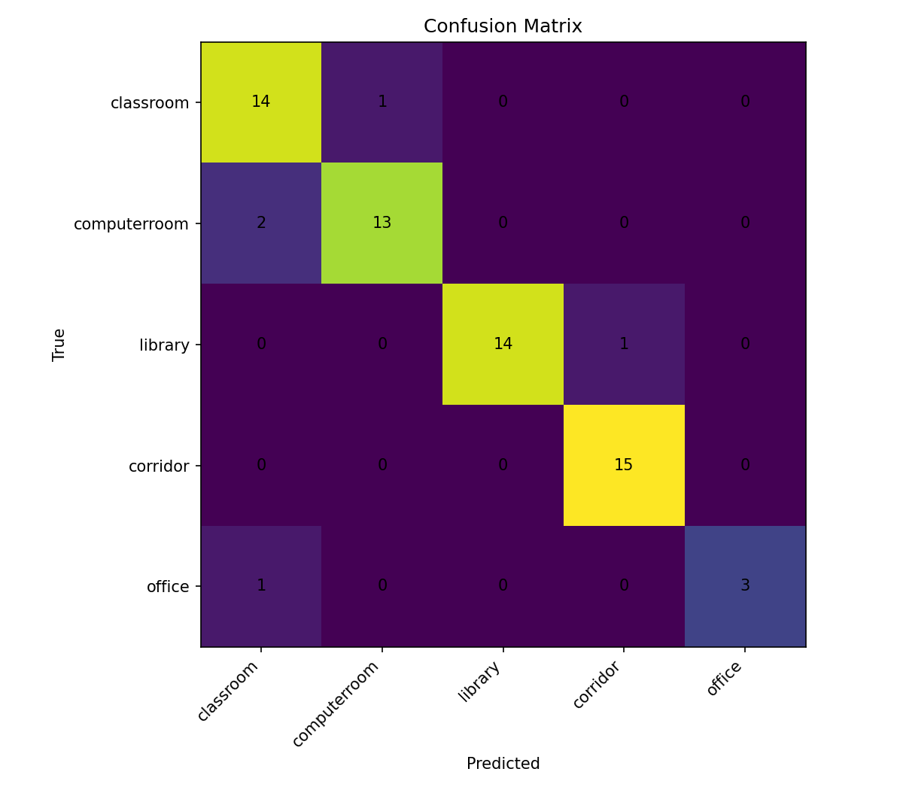
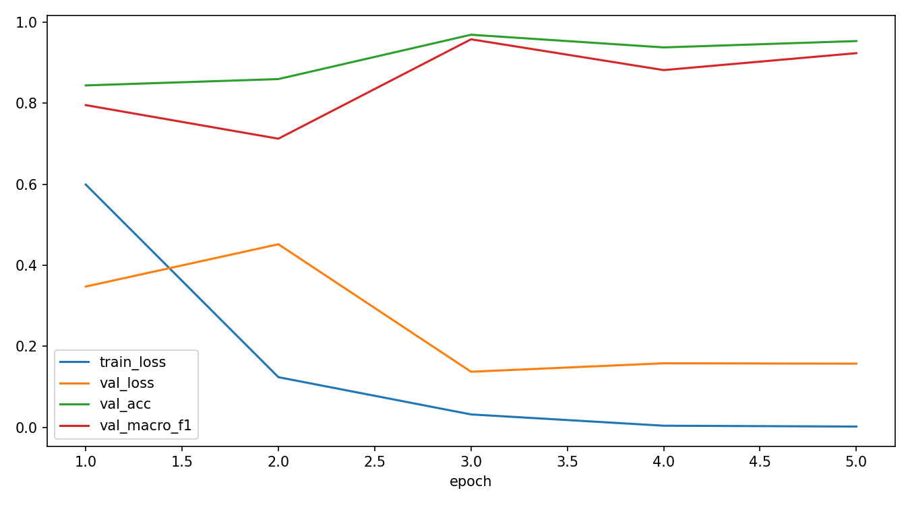

# BÁO CÁO LAB 5 – CSC4005

# Vision Transformer cho bài toán phân loại cảnh trong nhà

---

# 1. Thông tin sinh viên

* Họ và tên: Nguyễn Đức Dương
* MSSV: 1771040008
* Lớp: KHMT 17-01
* Nhóm: Nhóm 5
* GitHub Repo: [https://github.com/FIT-DNU-CS-16-01/csc4005-lab5-khmt_1701_nhom5](https://github.com/FIT-DNU-CS-16-01/csc4005-lab5-khmt_1701_nhom5)
* Link Weights & Biases: [https://wandb.ai/ducduonglop8a-hanoi/csc4005-lab6-mit-indoor-vit?nw=nwuserducduonglop8a](https://wandb.ai/ducduonglop8a-hanoi/csc4005-lab6-mit-indoor-vit?nw=nwuserducduonglop8a)

---

# 2. Giới thiệu

## 2.1 Mục tiêu bài lab

Mục tiêu của bài lab là xây dựng hệ thống phân loại cảnh trong nhà sử dụng mô hình Vision Transformer (ViT). Mô hình được huấn luyện và đánh giá trên tập dữ liệu MIT Indoor Scenes.

Nội dung chính của bài lab bao gồm:

* Tìm hiểu kiến trúc Vision Transformer.
* Áp dụng transfer learning với mô hình ViT pretrained.
* So sánh giữa head-only training và full fine-tuning.
* Đánh giá mô hình bằng Accuracy và Macro-F1.

---

## 2.2 Tổng quan về Vision Transformer

Khác với Convolutional Neural Networks (CNNs), Vision Transformer chia ảnh thành nhiều patch nhỏ và xử lý chúng như các token trong Transformer.

Với ảnh đầu vào kích thước 224×224 và patch size 16×16:

[
224 / 16 = 14
]

Tổng số patch:

[
14 	imes 14 = 196
]

Mỗi patch được embedding thành vector đặc trưng và đưa qua các lớp Transformer Encoder.

---

# 3. Dataset

## 3.1 Mô tả dataset

Dataset sử dụng:

* MIT Indoor Scenes 67
* Link dataset chính thức:
  [http://web.mit.edu/torralba/www/indoor.html](http://web.mit.edu/torralba/www/indoor.html)

Các lớp được chọn:

1. classroom
2. computerroom
3. library
4. corridor
5. office

---

## 3.2 Chuẩn bị dữ liệu

Tạo subset dataset bằng script:

```bash
python -m src.prepare_subset --source_dir "data/indoorCVPR_09/Images" --output_dir "data/mit_indoor_smartcampus_5" --classes classroom computerroom library corridor office --max_per_class 100
```

Thống kê dữ liệu:

| Lớp          | Số lượng ảnh |
| ------------ | ------------ |
| classroom    | 100          |
| computerroom | 100          |
| library      | 100          |
| corridor     | 100          |
| office       | 32           |

Tổng số ảnh:

432 ảnh

---

# 4. Môi trường thực nghiệm

## 4.1 Phần cứng

* CPU: AMD Ryzen / AMD Radeon
* GPU: Không có NVIDIA GPU
* Hệ điều hành: Windows

---

## 4.2 Phần mềm và thư viện

* Python 3.x
* PyTorch
* torchvision
* pandas
* scikit-learn
* matplotlib
* wandb

Tạo môi trường ảo:

```bash
python -m venv venv
```

Kích hoạt môi trường:

```powershell
.\venv\Scripts\Activate.ps1
```

Cài thư viện:

```bash
pip install -r requirements.txt
```

---

# 5. Kiến trúc mô hình

## 5.1 Mô hình sử dụng

Mô hình được sử dụng:

* ViT-B/16 (Vision Transformer Base)
* Pretrained trên ImageNet

Các thông số chính:

| Tham số          | Giá trị    |
| ---------------- | ---------- |
| Tổng số tham số  | 85,802,501 |
| Kích thước ảnh   | 224 × 224  |
| Patch Size       | 16 × 16    |
| Số lớp phân loại | 5          |

---

## 5.2 Các chế độ huấn luyện

### Head-only Training

* Freeze toàn bộ backbone của ViT.
* Chỉ train classification head.

Số tham số được train:

```text
3845
```

---

### Full Fine-tuning

* Huấn luyện toàn bộ Vision Transformer.

Trainable ratio:

```text
1.0
```

---

# 6. Thực nghiệm

## 6.1 Debug Smoke Test

Lệnh chạy:

```bash
python -m src.train --config configs/debug_smoke.json --data_dir "data/mit_indoor_smartcampus_5"
```

Kết quả:

| Metric        | Giá trị |
| ------------- | ------- |
| Test Accuracy | 80.00%  |
| Test Macro-F1 | 73.33%  |

Smoke test xác nhận:

* Dataset được load đúng.
* Vision Transformer hoạt động thành công.
* Pipeline train hoạt động bình thường.

---

## 6.2 Baseline – Head Only Training

Lệnh chạy:

```bash
python -m src.train --config configs/baseline_vit_head_only.json --data_dir "data/mit_indoor_smartcampus_5" --run_name nhom5_vit_head_only
```

Kết quả huấn luyện:

| Metric        | Giá trị |
| ------------- | ------- |
| Best Epoch    | 2       |
| Test Accuracy | 92.19%  |
| Test Macro-F1 | 91.24%  |
| Test Loss     | 0.317   |

Nhận xét:

* Validation accuracy tăng nhanh ở các epoch đầu.
* Early stopping giúp tránh overfitting.
* Feature pretrained của ViT hoạt động rất hiệu quả dù chỉ train classification head.

---

## 6.3 Full Fine-tuning

Lệnh chạy:

```bash
python -m src.train --data_dir "data/mit_indoor_smartcampus_5" --train_mode finetune --epochs 5 --batch_size 4 --lr 0.00005
```

Kết quả huấn luyện:

| Metric        | Giá trị |
| ------------- | ------- |
| Best Epoch    | 3       |
| Test Accuracy | 92.19%  |
| Test Macro-F1 | 91.24%  |
| Test Loss     | 0.172   |

Nhận xét:

* Validation Macro-F1 đạt 95.75%.
* Fine-tuning cải thiện hiệu quả train đáng kể.
* Xuất hiện overfitting nhẹ sau epoch 3.
* Kết quả test cuối cùng gần tương đương head-only training.

---

# 7. Phân tích kết quả

## 7.1 So sánh hiệu năng

| Phương pháp        | Accuracy | Macro-F1 |
| ------------------ | -------- | -------- |
| Head-only Training | 92.19%   | 91.24%   |
| Full Fine-tuning   | 92.19%   | 91.24%   |

Phân tích:

* Cả hai phương pháp đều cho kết quả tốt.
* Head-only training đã đủ hiệu quả cho dataset nhỏ.
* Fine-tuning làm tăng độ phức tạp mô hình nhưng không cải thiện đáng kể test accuracy.

---

## 7.2 Phân tích Confusion Matrix



Một số nhầm lẫn có thể xảy ra:

* classroom ↔ office
* corridor ↔ library

Nguyên nhân:

* Các lớp có cấu trúc không gian tương tự.
* Ánh sáng và nội thất gần giống nhau.
* Lớp office có ít dữ liệu hơn.

---

## 7.3 Learning Curves



Phân tích:

* Training loss giảm đều.
* Validation accuracy tăng nhanh.
* Early stopping giúp mô hình ổn định hơn.

---

# 8. Theo dõi thực nghiệm bằng W&B

Weights & Biases được sử dụng để:

* Theo dõi metric trong quá trình train.
* Trực quan hóa learning curves.
* So sánh các thực nghiệm.
* Theo dõi validation performance.

Link W&B:

[https://wandb.ai/ducduonglop8a-hanoi/csc4005-lab6-mit-indoor-vit?nw=nwuserducduonglop8a](https://wandb.ai/ducduonglop8a-hanoi/csc4005-lab6-mit-indoor-vit?nw=nwuserducduonglop8a)

---

# 9. Khó khăn và hạn chế

Khó khăn gặp phải:

* Không có NVIDIA GPU.
* Toàn bộ quá trình train chạy trên CPU.
* Lỗi Unicode path trên Windows.
* Dataset nhỏ và mất cân bằng dữ liệu.

Hạn chế:

* Lớp office có ít dữ liệu.
* Dataset nhỏ làm giảm khả năng tổng quát hóa.
* Thời gian train trên CPU khá lâu.

---

# 10. Kết luận

Trong bài lab này, hệ thống phân loại cảnh trong nhà bằng Vision Transformer đã được xây dựng và đánh giá thành công.

Mô hình ViT pretrained đạt hiệu năng tốt trên tập dữ liệu MIT Indoor subset.

Các kết quả đạt được:

* Xây dựng thành công Vision Transformer.
* So sánh head-only training và full fine-tuning.
* Đạt khoảng 92% test accuracy.
* Tích hợp theo dõi thực nghiệm bằng Weights & Biases.

Kết quả cho thấy transfer learning với Vision Transformer hoạt động hiệu quả ngay cả trên dataset nhỏ.

---

# 11. Tài liệu tham khảo

1. Dosovitskiy et al., “An Image is Worth 16x16 Words: Transformers for Image Recognition at Scale”, 2020.
2. MIT Indoor Scene Recognition Dataset.
3. Tài liệu PyTorch.
4. Tài liệu Vision Transformer.
5. Tài liệu Weights & Biases.
